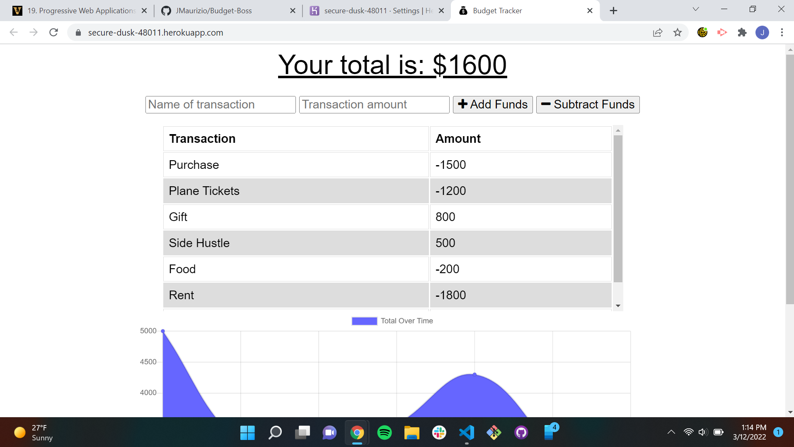

# Budget-Boss

## Description

A progressive web application built using MongoDB, Mongoose and Express.  The application was built to help users track their budget and built with persistence online and offline. When the application is offline and a expense is entered the database will be updated with the expense when the application goes back online.

## Screenshot

## Links

Depolyed Application: https://secure-dusk-48011.herokuapp.com/
Repo Link: https://github.com/JMaurizio/Budget-Boss